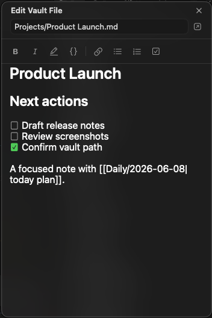
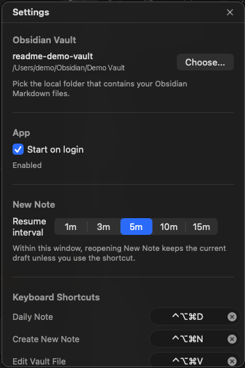

# Obsidian Side Note

A small macOS menu bar app for capturing Markdown into an Obsidian vault without leaving the app you are currently using.

Obsidian Side Note opens a compact floating editor from the menu bar or a global shortcut. It can create new notes, continue a daily note, search existing Markdown files, edit them in place, and save everything back to your local vault.

## Screenshots

<p align="center">
  
  
</p>

## What It Does

- Opens from the macOS menu bar and stays out of the Dock.
- Provides global shortcuts for Daily Note, Create New Note, and Edit Vault File.
- Creates Markdown notes directly inside your selected Obsidian vault.
- Autosaves new notes and edits to existing vault files.
- Avoids empty files: a title-only draft stays local until the note has body text.
- Searches Markdown files by title or vault-relative path.
- Renders Markdown preview, Obsidian wikilinks, images, videos, and embeds.
- Copies pasted or dropped media into the vault attachment folder when configured.
- Keeps Settings and Quit local so the app does not steal normal shortcuts from other apps.

## Requirements

- macOS compatible with the project target.
- Xcode 26 or newer for local builds.
- Obsidian for Daily Note creation and "Open in Obsidian" behavior.
- A local Obsidian vault folder.
- The Obsidian Daily notes core plugin for Daily Note workflows.
- The Obsidian Advanced URI community plugin for URI-driven Obsidian actions.

The app is built with SwiftUI, AppKit, Carbon global hotkeys, AVKit, and [swift-markdown-ui](https://github.com/gonzalezreal/swift-markdown-ui).

## Installation

Download a release `.dmg` from [GitHub Releases](https://github.com/lenard-d/obsidian_side_note/releases), open it, and drag `ObsidianSideNote.app` into `/Applications`.

Release builds may not be notarized yet. If macOS blocks the first launch:

1. Open Finder and go to `/Applications`.
2. Control-click `ObsidianSideNote.app`.
3. Choose `Open`.
4. Confirm the macOS security dialog.

If needed, remove the quarantine attribute:

```bash
xattr -dr com.apple.quarantine /Applications/ObsidianSideNote.app
open /Applications/ObsidianSideNote.app
```

For a local build:

```bash
xcodebuild \
  -project ObsidianSideNote.xcodeproj \
  -scheme ObsidianSideNote \
  -configuration Release \
  -derivedDataPath build/DerivedData \
  build

cp -R build/DerivedData/Build/Products/Release/ObsidianSideNote.app /Applications/
open /Applications/ObsidianSideNote.app
```

More setup notes are in [docs/INSTALLATION.md](docs/INSTALLATION.md).

## First Setup

1. Launch `ObsidianSideNote.app`.
2. Install and enable Obsidian's Advanced URI plugin.
3. Enable Obsidian's Daily notes core plugin if you want Daily Note support.
4. Open Obsidian Side Note settings.
5. Select your local Obsidian vault folder.
6. Review the default keyboard shortcuts.
7. Choose how long New Note drafts should be resumed.

The selected vault is stored as a security-scoped bookmark so the sandboxed app can keep access across launches.

## Usage

### Menu Actions

- `Daily Note`: open today's daily note in the floating editor.
- `Create New Note`: start a Markdown note in the selected vault.
- `Edit Vault File`: search and edit an existing Markdown file.
- `Settings`: select the vault, configure shortcuts, and set the draft resume interval.

### Default Shortcuts

- `Control-Option-Command-D`: Daily Note.
- `Control-Option-Command-N`: Create New Note.
- `Control-Option-Command-V`: Edit Vault File.
- `Command-,`: Settings while the app is active.
- `Command-Q`: Quit while the app is active.

Global shortcuts must include Control or Option. Command-only app-management shortcuts remain local so Obsidian Side Note does not intercept standard commands from your foreground app.

### New Notes

New notes autosave into the selected vault once the body has content. If you close a title-only note, it remains a local draft and no empty Markdown file is created.

Reopening New Note from the menu can resume the current draft within the configured interval. Using the New Note shortcut starts a fresh draft.

### Existing Notes

Choose `Edit Vault File`, type part of a note title or path, and select a result with the mouse, arrow keys, Tab, or Return. Edits save back to the Markdown file immediately.

### Media And Links

Preview mode supports regular Markdown links, Obsidian wikilinks, local media, remote images, and Obsidian embeds:

```markdown
[[Project Plan]]
[[Project Plan|Planning]]
![[Sketch.png]]

```

Pasted images and supported dropped media files are copied into Obsidian's configured attachment folder. If no fixed attachment folder is configured, the app stores the media at the vault root.

Supported preview formats:

- Images: `apng`, `avif`, `gif`, `jpeg`, `jpg`, `png`, `svg`, `webp`
- Videos: `m4v`, `mov`, `mp4`

## Development

Open the project:

```bash
open ObsidianSideNote.xcodeproj
```

Run unit tests:

```bash
xcodebuild test \
  -project ObsidianSideNote.xcodeproj \
  -scheme ObsidianSideNote \
  -destination 'platform=macOS' \
  -only-testing:ObsidianSideNoteTests
```

Run static analysis:

```bash
xcodebuild analyze \
  -project ObsidianSideNote.xcodeproj \
  -scheme ObsidianSideNote \
  -destination 'platform=macOS'
```

Check whitespace before committing:

```bash
git diff --check
```

## Project Layout

```text
ObsidianSideNote/
  Models/       Small domain types for note modes, shortcuts, and vault notes.
  Services/     Global hotkeys, logging, media import, and Obsidian URI helpers.
  Stores/       UserDefaults preferences, vault access, and file persistence.
  Support/      AppKit and SwiftUI integration helpers.
  Views/        Settings, setup, editor chrome, Markdown editor, and preview UI.

ObsidianSideNoteTests/
  Unit tests for vault behavior, shortcuts, URIs, drafts, search, and media parsing.
```

See [docs/ARCHITECTURE.md](docs/ARCHITECTURE.md) for the internal design notes.

## Status

Obsidian Side Note is usable, but still evolving. Known next steps:

- Developer ID signing and notarization.
- Built-in launch-at-login management.
- Window size and position preferences.
- Multiple vault support.
- Note templates.

## Acknowledgments

This project started from Luke Smith's original Obsidian Side Note repository: [lukesmith96/obsidian_side_note](https://github.com/lukesmith96/obsidian_side_note).

Markdown rendering uses [swift-markdown-ui](https://github.com/gonzalezreal/swift-markdown-ui). Obsidian integration is based on local Markdown files and [Obsidian URI](https://help.obsidian.md/uri).
